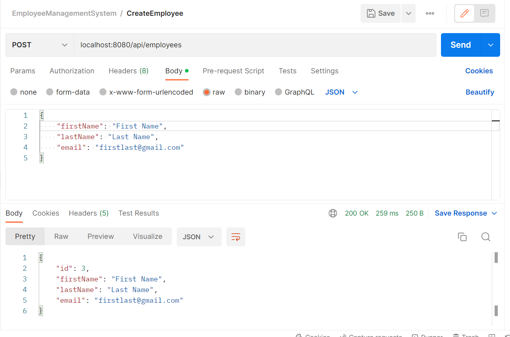
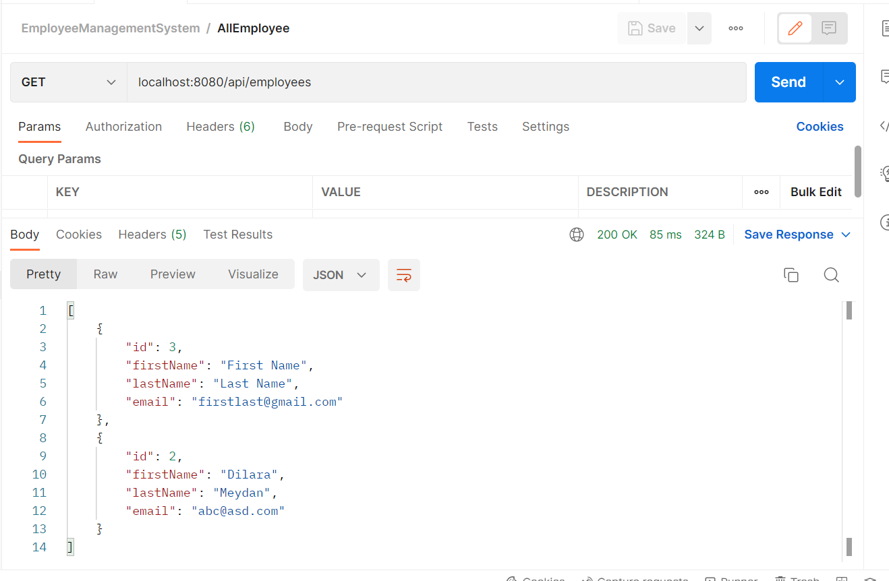
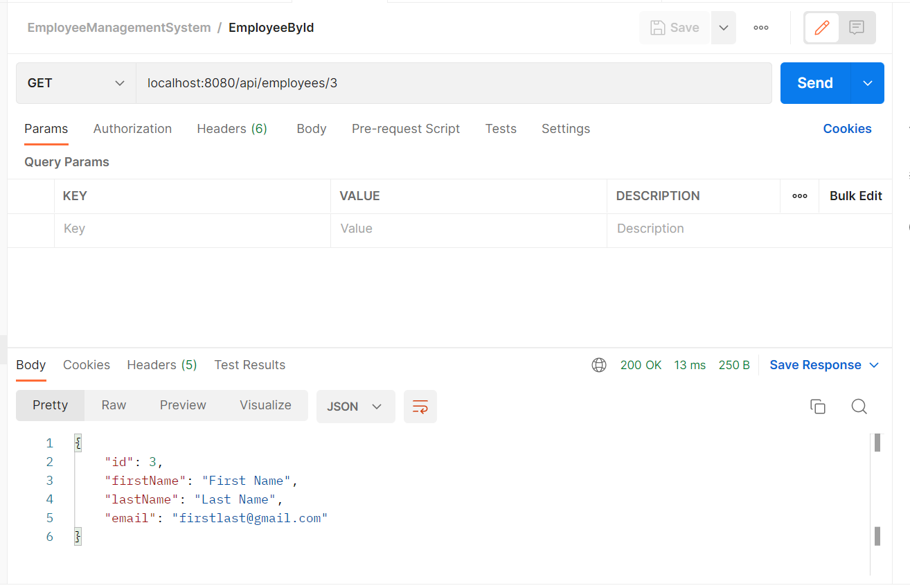
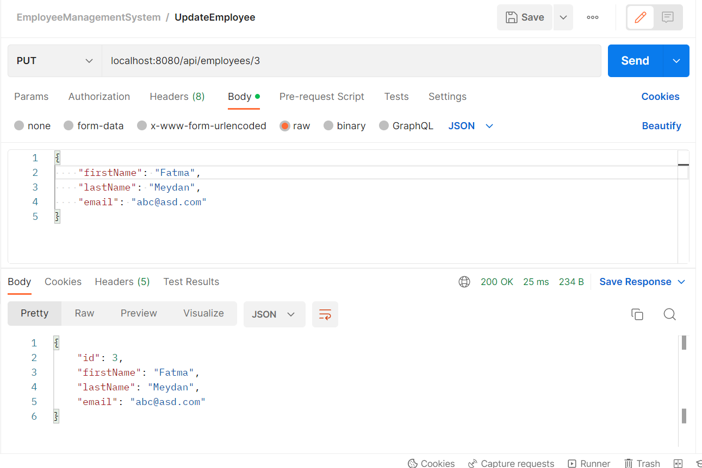
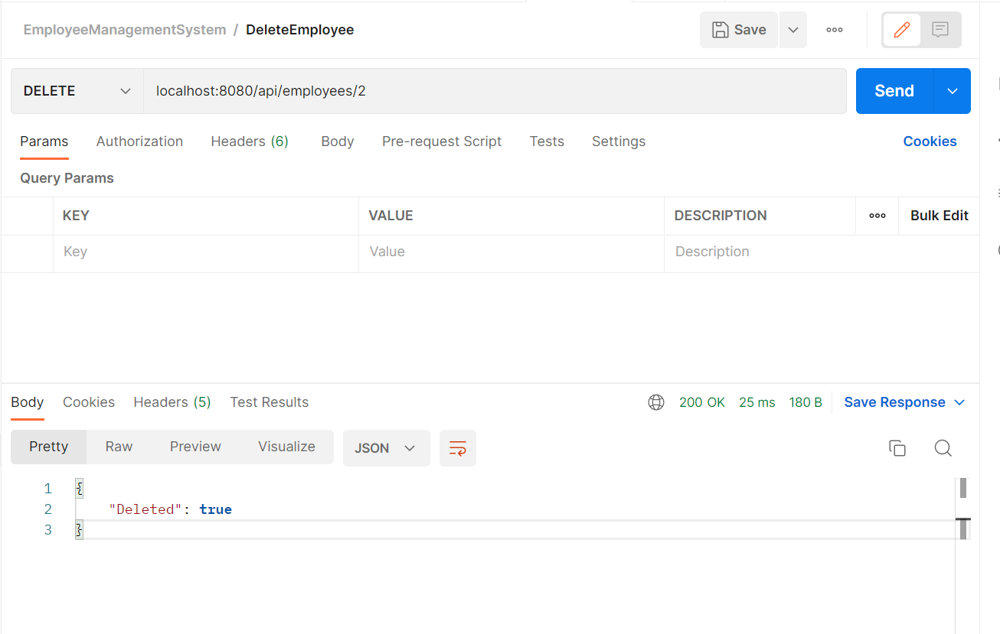
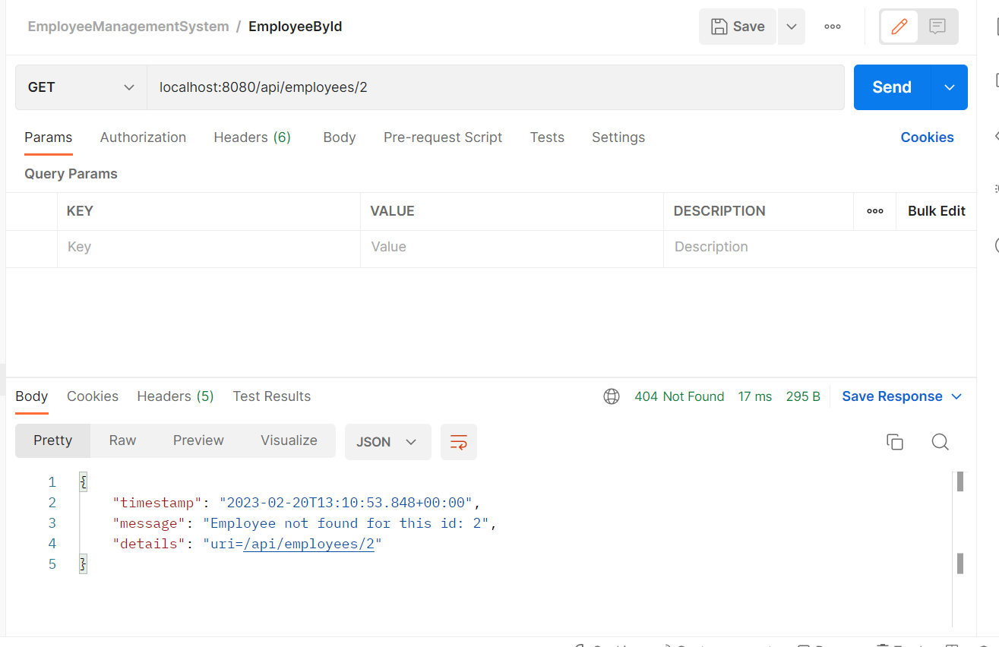

# Employee Management System
Spring Boot project to use a PostgreSQL database and create a Restful API.

## POST OPERATION

### Create Employee:

## GET OPERATION

### All Employee:

### Employee By Id:

## PUT OPERATION

### Update Employee:

## DELETE OPERATION

### Delete Employee:

### Employee By Id: (Error Detail)

